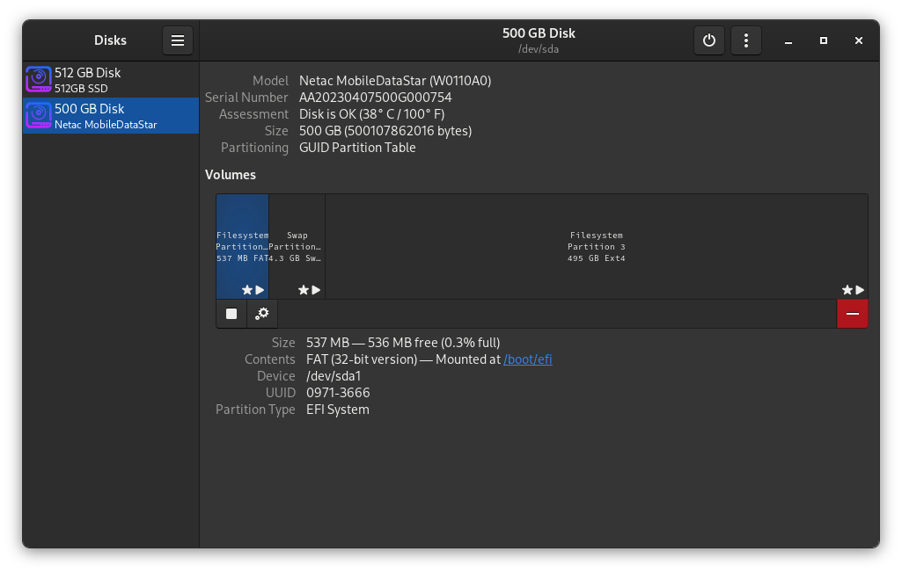
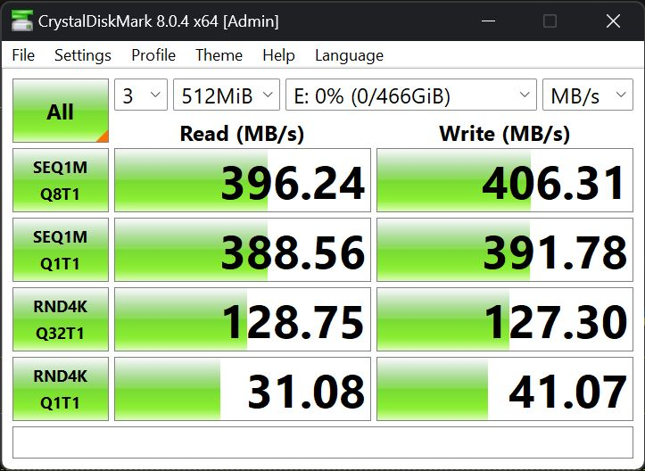
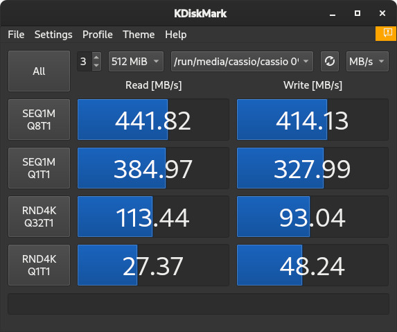
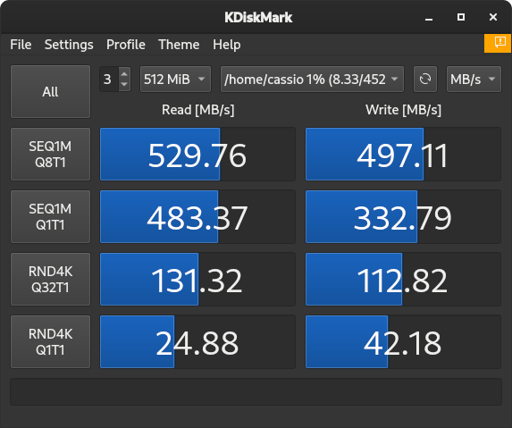
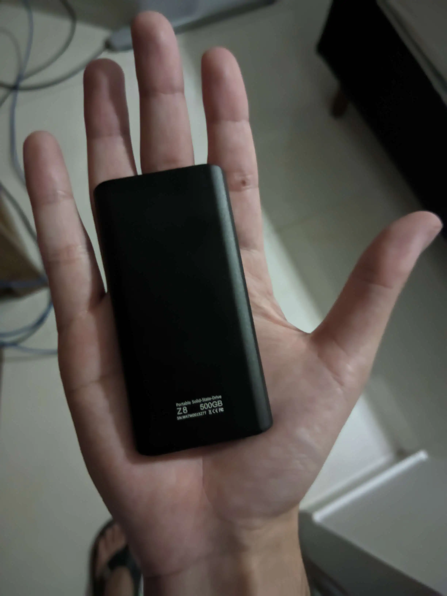

Hi, Cassio here!

Today I'll write a quick review on [Netac Z8 External SSD](https://www.netac.com/product/Z8-79.html) (500GB Version).

<!-- truncate -->

## Verdict

This SSD was for sure a good deal! It is small, robust and fast. It also comes with a UBC type-C adapter and cable!

- Total (4.5/5)
- Temperature (5/5)
- Performance (4/5)
- Construction (5/5)
- Value (5/5)

## Temperature

It's temperature is awesome, in benchmarks my max was about 45°c and in the image bellow I'm using it at this moment I am writing to write this post while I'm running this website on Docker.

## Performance

For an external portable SSD it was a awesome performance, I did not give full points because it should have achieved 500 MB/s  in all scenarios as said in the package.

### Netac Z8 ExFAT (Windows)

I ran this test on windows with ExFAT filesystem that is owned by microsoft. This filesystem is ideal for portable storage devices and can also run on Linux with kernel version 5.4 or higher.

---

### Netac Z8 FAT32 (Linux)

This test was done on Linux with FAT32 filesystem that is older than ExFAT but with more compatibility.

---

### Netac Z8 EXT4 (Linux)

The last test was also done on Linux but with EXT4 open source filesystem that's most used on Linux installations.

---

## Construction

As I said, it's small, robust and fast. I forgot to mention that the package also comes with a protector besides an USB type-C adapter. In the image bellow you can check it's really small, even fitting in my hand.

## Value

I bought it for less than $35 so it was $0.07/GB an awesome price (besides the amazing performance)! Sadly it's currently out of stock so I can't share the link.

## Conclusion

1. Pros
   1. Awesome performance for a portable SSD
   2. Very tiny, robust and comes with a protector and adapter
   3. Low temperatures
2. Cons
   1. Performance in the announcement was higher
