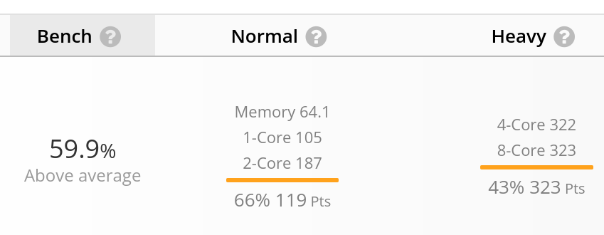
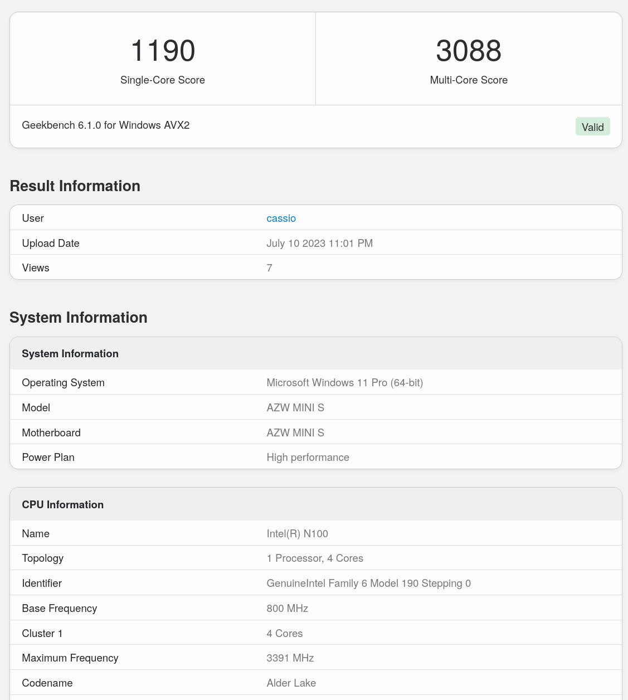
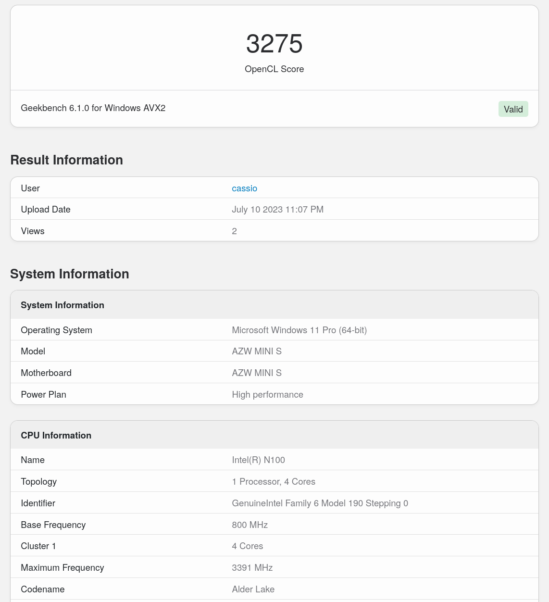
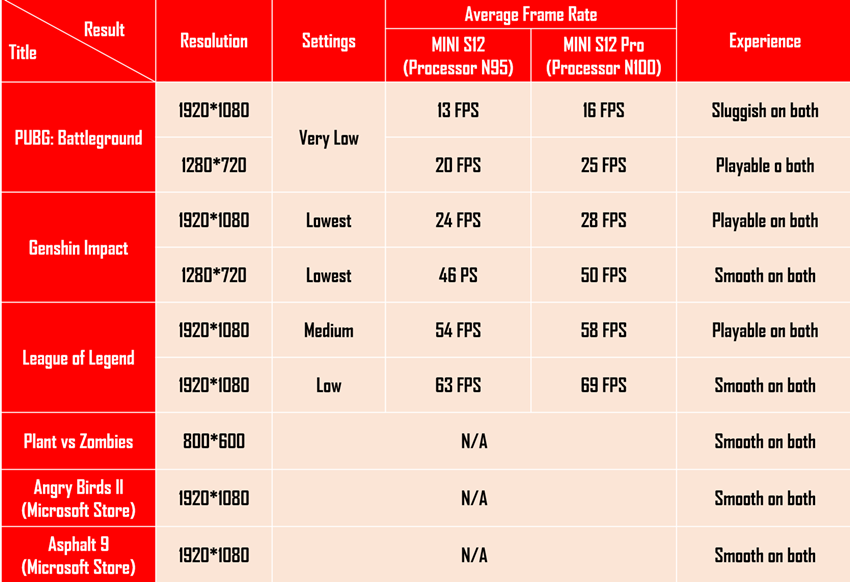

Hi, Cassio here!

Today I'll write a quick review on [Beelink S12 Pro](https://pt.aliexpress.com/item/1005004260803924.html) (16GB RAM / 500GB SSD Version).

<!-- truncate -->

## Verdict

This MiniPC was an amazing deal! You can sure use it to work and play 4K videos smoothly (even play some games). I use it mostly for coding and working.

:::caution

I highly recommend to check thermals, in some case this MiniPC comes with dry thermal paste (It was sadly my case).

:::

- Total (5/5)
- Temperature (5/5)
- Performance (5/5)
- Construction (4/5)

## Main Specs

- CPU: [Intel N100 (4/4 6W TDP)](https://ark.intel.com/content/www/us/en/ark/products/231803/intel-processor-n100-6m-cache-up-to-3-40-ghz.html)
- RAM: 1x16GB DDR4 3200MHZ
- SSD: 500GB NVME GEN 3

## Temperature

As said this PC didn't arrive with thermal paste so I had to apply one myself. With the new thermal paste the temperatures are about 40°c in normal workload.

## Performance

This little guy really surprised me with the performance. As it's a 6W TDP CPU I thought it would struggle even in simple tasks even more in programming. But it was not the case, the PC boot time, application start time and responsiveness is really awesome! Bellow I'll show some benchmark results and compare with similar CPUs.

### Userbenchmark

In this test, S12 PRO made 105 single core points and 322 quad core points (this is the normal range for daily tasks). As good comparison, [Intel Core i7-1065G7](https://ark.intel.com/content/www/us/en/ark/products/196597/intel-core-i71065g7-processor-8m-cache-up-to-3-90-ghz.html) scores 94 in single core and 271 in quad core and this is a good laptop CPU with 25W TDP (remember Intel N100 uses only 6W!).

Comparing with [Intel i3-10100](https://ark.intel.com/content/www/us/en/ark/products/199283/intel-core-i310100-processor-6m-cache-up-to-4-30-ghz.html) (also 4 cores but a desktop CPU with 65W) we can see some differences, single core score is 120 and quad core is 402.

### Geekbench 6

#### CPU

In terms of CPU performance Intel N100 really made a [good job making 1190 single core points and 3088 multi core points](https://browser.geekbench.com/v6/cpu/1877864). [My Ryzen 5 3600 on the same test made 1663 single core and 6643 on multi core](https://browser.geekbench.com/v6/cpu/1869896), in this test N100 scored almost the same result as [Intel Core i5-1035G1](https://ark.intel.com/content/www/us/en/ark/products/196603/intel-core-i51035g1-processor-6m-cache-up-to-3-60-ghz.html). You can check some of my Geekbench 6 results on [this link](https://browser.geekbench.com/user/474744).

#### GPU

Now talking about GPU performance it's not surprising that even with a good performance it was nowhere near a dedicated one. In terms of games it can run emulators with a good performance and some titles as showed in the image bellow from [this awesome review](https://forum.xda-developers.com/t/beelink-mini-s12-and-mini-s12-pro-review-budget-mini-pcs-that-checked-all-the-boxes.4562923/):

## Construction

S12 PRO is really small, I have a rugged phone and is huger than the PC 😂. It's really easy to open it and make upgrades/repairs, the cooler and airflow is also very good. The only complain I have is that in my case the thermal paste was completely dry and I needed to apply a new one:

## Value

The price at the moment I bought it was $165, I made some comparison with alternatives and though it was not the best on in terms of performance it is for sure the best in terms of value. As it's currently on stock [I'll share the link](https://www.aliexpress.com/item/1005004260803924.html), watchout for discount coupons and temporary sales.

## Conclusion

1. Pros
   1. Awesome performance for a portable PC smaller than a smartphone
   3. Really low temperatures (41°c at the moment I am coding this)
   4. Good and easy to maintain construction
   5. A lot of good connections
2. Cons
   1. Sometimes it can arrive with dry thermal paste
   2. Not good if you want to play heavy games
