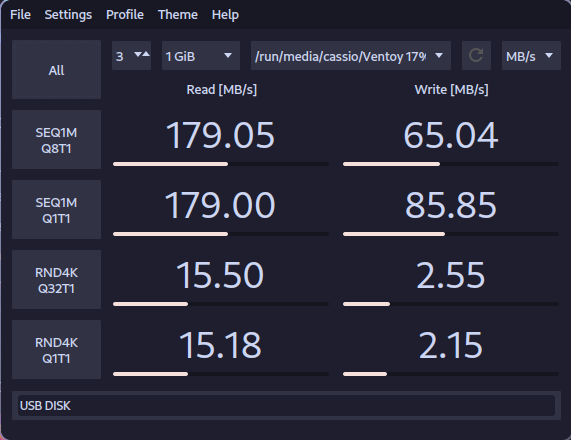
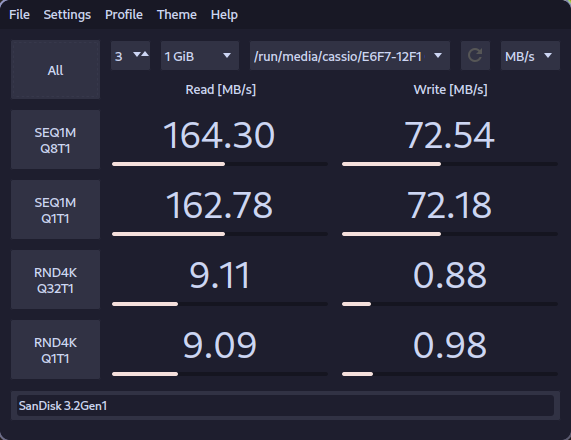
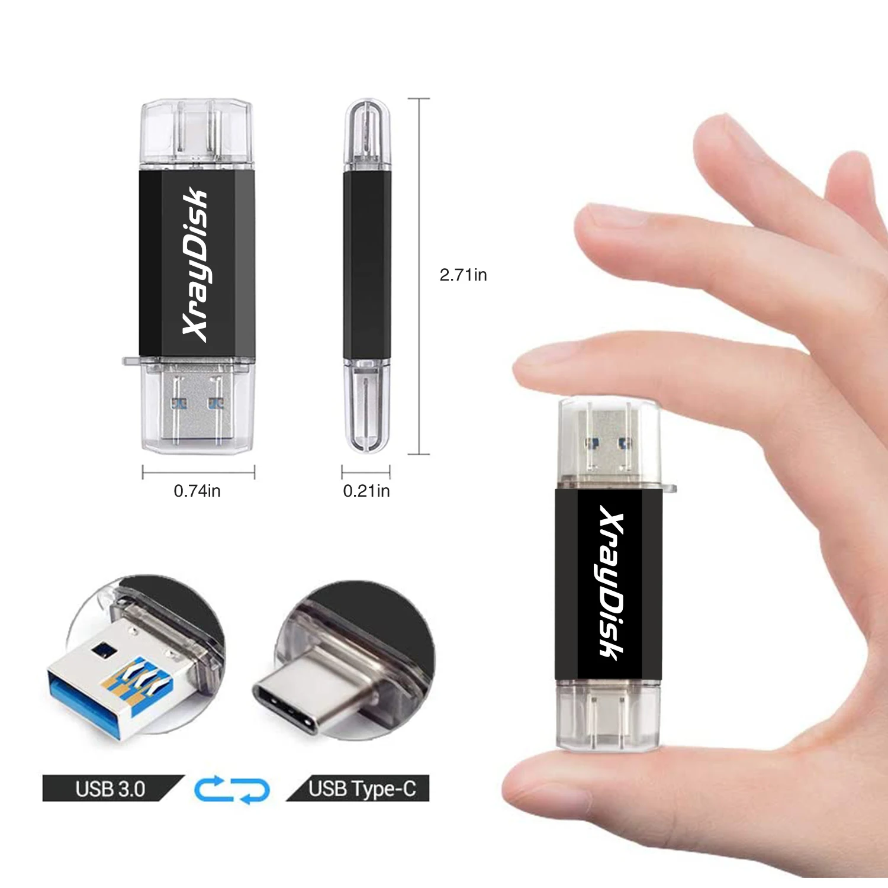

Hi, Cassio here!

Today I'll write a quick review on [XrayDisk XRUC3](https://www.aliexpress.com/item/1005003651117074.html) (128GB Version).

<!-- truncate -->

## Verdict

After using multiple brands like Sandisk, Kingston, etc. I can say that this is the best USB flash drive I ever had! It's fast, it's small and it's cheap!

- Total (5/5)
- Temperature (5/5)
- Performance (5/5)
- Construction (5/5)
- Value (5/5)

## Temperature

My usage for this USB flash drive is to transfer large files and store OS images (Windows 10, Windows 11, Linux distros, etc.) with Ventoy. Even with this heavy usage I never noticed any heat from the USB flash drive.

## Performance

The benchmark in the image below was done after 2 years of usage and it's still fast! Below there is also a Sandisk Ultra Dual Drive USB 3.1 128GB benchmark for comparison. 

---

### XrayDisk XRUC3

---

### Sandisk Ultra Dual Drive USB 3.1 (SDDDC2)

## Construction

The construction is really good, it's small, light and robust. Both USB type-A and USB type-C connectors are really good and both are protected by a cap.

## Value

I bought this USB flash drive for $12 on AliExpress and it was worth every penny! I would buy it again if I needed another USB flash drive.
Now this USB flash drive is $9.88 on AliExpress, so it's even cheaper than when I bought it! That's definitely a must buy!
